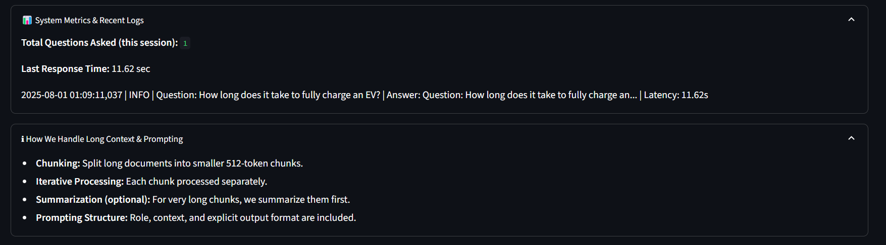
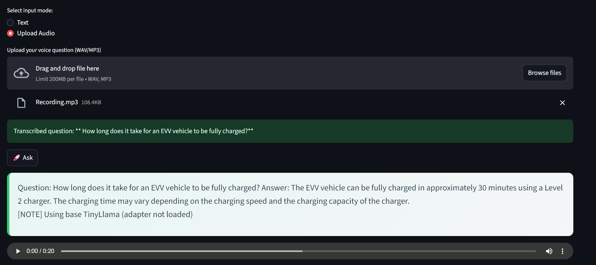

# ⚡ EV-QA: Domain-Specific Electric Vehicle Question Answering

[](https://huggingface.co/spaces/Basel-Amr/ev-qa-api)

An **end-to-end pipeline** for building and deploying a **domain-specific Question Answering (QA) model** for Electric Vehicles (EVs).  
This project covers:
- **Data collection & processing**
- **Hybrid dataset generation**
- **Long-context handling**
- **LoRA fine-tuning**
- **Evaluation**
- **Interactive deployment on Hugging Face Spaces**

---

## **Live Demo**
Try the deployed model here 👉 **[EV-QA on Hugging Face Spaces](https://huggingface.co/spaces/Basel-Amr/ev-qa-api)**

---
## **Key Features**
- **Automated Data Collection:** PDF parsing & rule-based extraction.
- **Dataset Generation:** 1000 QA pairs from EV-related PDFs + 50 manually curated QAs.
- **Long Context Handling:** Automatic document chunking to handle long texts exceeding model token limits.
- **Fine-Tuning:** TinyLlama + LoRA adapters.
- **Evaluation Metrics:** F1, Exact Match, BLEU, ROUGE.
- **Deployment:** Docker + Hugging Face Spaces (Streamlit interface).

---


## **Visual Demo**

### **System Logs**


### **Upload & Record Interface**


### **Demo Video**
[▶ Watch Demo Video](Assets/demo_video.mp4)

---

## **📂 Project Structure**
```
genai-ev-qa/
│
├── data/                     # Raw and processed data
│   ├── raw/                  # Original sources (PDFs, manual entries)
│   └── processed/            # Clean CSV and generated QA dataset
│
├── src/
│ ├── data_collection.py # PDF scraping & web data
│ ├── data_processing.py # Cleaning & preprocessing
│ ├── dataset_generation.py # QA dataset generation (long-context support)
│ ├── pipeline.py # Training + evaluation orchestration
│ ├── utils_logger.py # Logging utilities
│
├── tests/
│ ├── test_data_collection.py
│ └── test_data_processing.py
├── models/                   # Fine-tuned LoRA adapters & base model checkpoints
│
├── logs/                     # Application & training logs
│
├── requirements.txt          # Python dependencies
├── interactive_qa.py # CLI interactive QA
├── Dockerfile                # For Hugging Face Spaces deployment
├── .github/workflows/ci-cd.yml # Automated training + deployment pipeline
└── README.md                 # This file
```

---

## **📊 Dataset & Data Collection**

### **Data Sources**
1. **PDF Extraction (Automated)**  
   - Extracted text from domain-specific Electric Vehicle documents.  
   - Used `pdfplumber` to parse PDFs and clean up text.
   - Generated **~1000 QA pairs** automatically using a **hybrid approach**:
     - **LLM-based generation** (Zephyr-7B).
     - **Fallback rule-based template questions** when the model failed.

2. **Manual Annotation (50 QA pairs)**  
   - Crafted **50 high-quality QA pairs** by hand for evaluation and improving dataset diversity.

---

## **🧠 Handling Long Context**
**Problem**: Some PDF extracts exceeded the token limit of our LLM model.  
**Solution**:
- **Chunking Algorithm**:
  - Split long text into **512-token chunks**.
  - Process each chunk independently.
  - Merge QA pairs from all chunks.
- **Benefits**:
  - Prevents model crashes due to overflow.
  - Ensures that **entire long documents** contribute to the training dataset.

**Code Reference**:
```python
def chunk_text(text, max_tokens=512):
    words = text.split()
    chunks, current, count = [], [], 0
    for word in words:
        count += len(word)
        if count > max_tokens:
            chunks.append(" ".join(current))
            current, count = [], len(word)
        current.append(word)
    if current:
        chunks.append(" ".join(current))
    return chunks
```

---

## **Dataset & Long Context Handling**
- **Data Sources:**  
  - Extracted EV-related text from PDFs and structured them into QA pairs (1000 generated automatically, 50 curated manually).
- **Long Context Problem:**  
  - LLMs have input size limits (TinyLlama = ~2048 tokens).
- **Solution:**  
  - **Chunking**: Split large documents into 512-token segments.
  - **Iterative QA Generation**: Generate questions for each chunk separately.
  - **Merge Outputs**: Combine QA pairs into one dataset while preserving context integrity.

---

## **Training**
- Model: `TinyLlama/TinyLlama-1.1B-Chat-v1.0`
- LoRA Configuration: `r=16`, `alpha=32`, `dropout=0.05`
- Optimizer: `AdamW`, LR = `2e-4`
- Evaluation: `Exact Match`, `F1`, `BLEU`, `ROUGE-1`, `ROUGE-L`

---

## **Deployment**
### **Hugging Face Spaces**
- Built **Docker-based custom Space**.
- Dockerfile:
```dockerfile
FROM python:3.10-slim
WORKDIR /app
COPY . .
RUN pip install --no-cache-dir -r requirements.txt
EXPOSE 7860
CMD ["streamlit", "run", "streamlit_app.py", "--server.port", "7860", "--server.address", "0.0.0.0"]

---

## **⚙️ Training Pipeline**
### **1. Generate Dataset**
```bash
python src/dataset_generation.py
```

### **2. Fine-Tune (LoRA)**
```bash
python src/pipeline.py
```
- **Base Model**: TinyLlama-1.1B-Chat-v1.0  
- **LoRA Parameters**: r=16, alpha=32, dropout=0.05  
- **Metrics**: Exact Match, F1, BLEU, ROUGE

---

## **🌐 Deployment**
### **Local**
```bash
streamlit run src/streamlit_app.py
```
Open [http://localhost:8501](http://localhost:8501)

### **Online**
- Deployed automatically to Hugging Face Spaces using:
  - `Dockerfile` (containerized build)
  - `.github/workflows/ci-cd.yml` (CI/CD automation)

---

## **🔑 Key Features**
- Automated **QA generation** (hybrid approach).
- **Long context support** (512-token chunking).
- LoRA fine-tuning for efficient domain adaptation.
- **Interactive Web UI**:
  - Text input
  - Voice input (Whisper STT)
  - Audio output (gTTS)
  - Token-based authentication
- **Monitoring**:
  - Logs & metrics panel in the Streamlit UI.

---

## **👨‍💻 Author**
**Basel Amr Barakat**  
- 📧 [baselamr52@gmail.com](mailto:baselamr52@gmail.com)  
- [GitHub](https://github.com/Basel-Amr) | [LinkedIn](https://www.linkedin.com/in/baselamrbarakat/) | [Kaggle](https://www.kaggle.com/baselamr1998)

---

## **📄 License**
Licensed under the [Apache 2.0 License](LICENSE).
